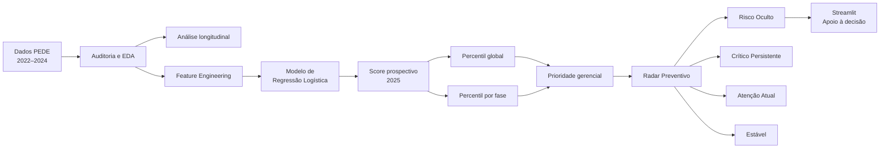

# 🎓 Datathon FIAP — Passos Mágicos
## Radar Preventivo de Risco Educacional

Solução desenvolvida no **Datathon da Pós Tech FIAP em Data Analytics** para a
**Associação Passos Mágicos**, combinando análise exploratória e longitudinal,
Machine Learning e uma aplicação analítica em Streamlit.

O objetivo do projeto é apoiar a evolução de um acompanhamento apenas
**reativo** para uma abordagem também **preventiva**, identificando estudantes
que ainda não apresentam defasagem, mas concentram sinais associados a maior
prioridade futura.

[](https://datathon-fiap-fase-5-osspa-magicos.streamlit.app/)
[](#)
[](#)
[](#)
[](#)

---

## 🔗 Acesso rápido

| Entregável | Acesso |
|---|---|
| 🚀 **Aplicação Streamlit** | **[Abrir aplicação](https://datathon-fiap-fase-5-osspa-magicos.streamlit.app/)** |
| 🧭 **Radar Preventivo** | **[Abrir Radar](https://datathon-fiap-fase-5-osspa-magicos.streamlit.app/Radar_Preventivo)** |
| 📊 **Apresentação executiva — PDF** | [Abrir apresentação](docs/Datathon_PassosMagicos_Apresentacao_Final.pdf) |
| 🖥️ **Apresentação — PowerPoint** | [Baixar PPTX](docs/Datathon_PassosMagicos_Apresentacaoppt.pptx) |
| 📓 **Notebook 01 — Auditoria e EDA** | [Abrir notebook](notebooks/01_auditoria_eda_passos_magicos.ipynb) |
| 🤖 **Notebook 02 — Modelo e análises avançadas** | [Abrir notebook](notebooks/02_modelo_risco_defasagem.ipynb) |
| 🎥 **Vídeo de apresentação** | **[Assistir no YouTube](COLOCAR_URL_YOUTUBE_AQUI)** |

> 🎥 **Vídeo:** após a publicação no YouTube, substituir
> `COLOCAR_URL_YOUTUBE_AQUI` pelo link final da apresentação.

---

# 📌 Resultados em 30 segundos

| Indicador | Resultado |
|---|---:|
| Estudantes na base de 2024 | **1.156** |
| Elegíveis ao modelo | **1.054** |
| Não elegíveis | **102** |
| Estudantes sem defasagem atual | **518** |
| Risco oculto identificado | **118 estudantes** |
| Risco oculto entre os sem defasagem | **22,78%** |
| Potenciais pontos cegos | **37 estudantes** |
| ROC-AUC no teste temporal | **0,7649** |
| PR-AUC no teste temporal | **0,8321** |
| Testes automatizados | **33 passed** |

## 💡 Principal insight

> Entre os **518 estudantes sem defasagem em 2024**, **118 — 22,78% —**
> aparecem nas prioridades prospectivas **Alta ou Muito alta** para 2025.

Esses estudantes formam o grupo denominado **Risco Oculto**.

Eles não são alunos que necessariamente ficarão defasados.

São estudantes que, apesar da situação atual aparentemente regular, apresentam
uma combinação de sinais historicamente associada a maior prioridade de
acompanhamento no período seguinte.

---

# 🏫 Problema de negócio

A Associação Passos Mágicos acompanha a evolução de crianças e jovens por meio
de diferentes dimensões educacionais, incluindo:

- **IDA** — Indicador de Desempenho Acadêmico;
- **IEG** — Indicador de Engajamento;
- **IAA** — Indicador de Autoavaliação;
- **IPS** — Indicador Psicossocial;
- **IPP** — Indicador Psicopedagógico;
- **IPV** — Indicador do Ponto de Virada;
- **INDE** — Índice de Desenvolvimento Educacional;
- classificação por **Pedras**:
  `Quartzo < Ágata < Ametista < Topázio`.

Uma estratégia baseada apenas na situação atual tende a ser
predominantemente **reativa**: o problema precisa aparecer para que o estudante
seja priorizado.

O desafio deste projeto foi responder:

> **É possível utilizar o histórico educacional para acrescentar uma camada
> preventiva ao acompanhamento dos estudantes?**

---

# 💻 Solução desenvolvida

A entrega integra três componentes:

### 1. Análise educacional

Auditoria, tratamento, exploração e análise longitudinal dos dados PEDE de
2022, 2023 e 2024.

### 2. Modelo preditivo

Modelo de Machine Learning para estimar um **score prospectivo de risco de
defasagem no período seguinte**.

### 3. Produto analítico

Aplicação **Streamlit multipágina**, transformando os resultados em uma
ferramenta de apoio à decisão.

O produto inclui:

- **Visão Executiva**
- **Radar Preventivo**
- **Ranking 2025**
- **Simulador Individual**
- **Predição em Lote**
- **Trajetória e Efetividade**
- **Modelo e Metodologia**

---

# 🧭 Fluxo da solução



---

# 🚨 Radar Preventivo

O **Radar Preventivo** é o principal diferencial do produto.

Ele cruza:

- a situação de defasagem **observada atualmente**;
- a prioridade **prospectiva** derivada do modelo.

Isso gera quatro perfis gerenciais:

| Perfil | Defasagem atual | Prioridade prospectiva |
|---|---|---|
| **Crítico persistente** | Sim | Alta / Muito alta |
| **Risco oculto** | Não | Alta / Muito alta |
| **Atenção atual** | Sim | Moderada / Reduzida |
| **Estável / menor prioridade** | Não | Moderada / Reduzida |

Na população elegível:

| Perfil | Estudantes |
|---|---:|
| Crítico persistente | **207** |
| Risco oculto | **118** |
| Atenção atual | **329** |
| Estável / menor prioridade | **400** |

---

## 🔎 Risco Oculto

A definição utilizada é:

> estudante **sem defasagem observada em 2024**, mas cujo posicionamento global
> ou relativo à própria fase o coloca nas prioridades **Alta ou Muito alta**
> para acompanhamento prospectivo.

Foram encontrados:

**118 estudantes**

Isso corresponde a:

**22,78% dos 518 estudantes sem defasagem atual.**

O conceito representa uma **priorização preventiva**, não um diagnóstico.

---

# 👁️ Potencial Ponto Cego

Foi criada uma segunda camada de análise dentro do Risco Oculto.

Um **Potencial Ponto Cego** é um estudante que:

- não apresenta defasagem atual;
- possui prioridade prospectiva elevada;
- está classificado como **Ametista ou Topázio**.

Foram encontrados:

**37 estudantes**

Representando:

**31,36% dos 118 casos de Risco Oculto**

Distribuição:

- **36 Ametistas**
- **1 Topázio**

Esses estudantes poderiam receber menor atenção caso a gestão observasse apenas
a situação atual e a classificação consolidada da Pedra.

---

# 🧬 DNA do Risco Oculto

Para compreender melhor o grupo, os estudantes de risco oculto foram comparados
com estudantes também sem defasagem e **dentro da mesma fase**.

As maiores diferenças padronizadas foram:

| Indicador | Diferença ajustada |
|---|---:|
| **IPV** | **-1,535** |
| **IEG** | **-1,367** |
| **IDA** | **-1,266** |
| IAA | -0,151 |
| Tempo no programa | -0,144 |
| IPS | +0,007 |

O padrão indica que o risco oculto está especialmente concentrado em:

> **Desempenho acadêmico + Engajamento + Desenvolvimento associado ao Ponto de Virada**

Como IDA, IEG e IPV participam do próprio modelo, esta análise deve ser
interpretada como **explicação do score**, e não como validação independente.

---

# 🔺 Triangulação com indicadores gerenciais

Também foram analisados indicadores que não fazem parte das sete features finais
do modelo.

### IPP

| Grupo | Média |
|---|---:|
| Risco oculto | **6,907** |
| Estável / menor prioridade | **7,914** |

Diferença ajustada:

**-1,104 desvios-padrão**

### INDE 2024

| Grupo | Média |
|---|---:|
| Risco oculto | **6,607** |
| Estável / menor prioridade | **8,112** |

Diferença ajustada:

**-1,540 desvios-padrão**

Esses resultados funcionam como **triangulação gerencial**.

O INDE e a Pedra são derivados de dimensões relacionadas aos indicadores
educacionais e, portanto, não constituem validação externa independente.

---

# 📉 Evolução da defasagem

A proporção de estudantes com defasagem apresentou redução entre 2022 e 2024:

| Ano | Com defasagem |
|---|---:|
| 2022 | **69,89%** |
| 2023 | **54,44%** |
| 2024 | **46,37%** |

Os casos de defasagem severa também diminuíram:

| Ano | Defasagem severa |
|---|---:|
| 2022 | 3,26% |
| 2023 | 1,38% |
| 2024 | 0,26% |

No painel longitudinal dos estudantes presentes nos três anos:

- **58,33%** melhoraram;
- **31,41%** mantiveram;
- **10,26%** pioraram.

---

# 📚 Desempenho acadêmico

Média do IDA:

| Ano | IDA médio |
|---|---:|
| 2022 | 6,093 |
| 2023 | 6,663 |
| 2024 | 6,351 |

Um resultado importante foi que a melhora na defasagem não foi acompanhada por
uma melhora equivalente do desempenho acadêmico.

No painel longitudinal válido:

**55,17% apresentaram redução do IDA entre 2022 e 2024.**

Isso reforça que:

> **progressão escolar e desempenho acadêmico representam dimensões diferentes
> da trajetória educacional.**

---

# 🤝 Engajamento

O IEG apresentou associação positiva consistente com IDA e IPV.

### Spearman — IEG × IDA

| Ano | Correlação |
|---|---:|
| 2022 | 0,507 |
| 2023 | 0,446 |
| 2024 | 0,517 |

### Spearman — IEG × IPV

| Ano | Correlação |
|---|---:|
| 2022 | 0,540 |
| 2023 | 0,492 |
| 2024 | 0,551 |

As relações são **associativas e não causais**.

---

# 🪨 Trajetória das Pedras

A evolução longitudinal considerou a ordem:

```text
Quartzo → Ágata → Ametista → Topázio
```

O painel completo contém:

**434 estudantes**

com Pedra válida em 2022, 2023 e 2024.

### Movimento 2022 → 2024

| Movimento | Percentual |
|---|---:|
| Avanço | **29,72%** |
| Manutenção | **44,24%** |
| Recuo | **26,04%** |

---

## Ágata + Ametista

Para reduzir efeitos de piso e teto de Quartzo e Topázio, também foi analisado
o grupo inicialmente em Ágata ou Ametista.

Total:

**311 estudantes**

| Movimento | Percentual |
|---|---:|
| Avanço | **35,69%** |
| Manutenção | **38,59%** |
| Recuo | **25,72%** |

Delta ordinal médio:

**+0,0675**

Mediana:

**0**

Wilcoxon pareado:

- estatística = **8328**
- p-valor = **0,2275**

Portanto:

> Há sinais positivos para determinados grupos, mas não evidência estatística
> suficiente de melhora ordinal sistemática em toda a população.

A conclusão adotada é de **efetividade heterogênea**.

Os dados são observacionais e não permitem atribuição causal.

---

# 🤖 Modelo preditivo

## Objetivo

Estimar a probabilidade de um estudante apresentar **defasagem no período
seguinte**.

O alvo foi definido como:

```text
RISCO_FUTURO = 1
quando DEFASAGEM_ANALISE no ano seguinte < 0
```

---

# 🕒 Protocolo temporal

A validação respeitou a ordem cronológica dos dados:

```text
2022 ─────────► 2023
 Desenvolvimento

2023 ─────────► 2024
 Teste temporal independente

2024 ─────────► 2025
 Inferência prospectiva
```

Essa estratégia reduz risco de vazamento temporal e permite avaliar o modelo em
um período posterior ao utilizado no desenvolvimento.

---

# 🧠 Modelo selecionado

O modelo final foi:

**Regressão Logística**

A escolha considerou:

- desempenho preditivo;
- PR-AUC;
- ROC-AUC;
- recall;
- interpretabilidade;
- simplicidade operacional;
- estabilidade.

---

# ⚙️ Pipeline

```text
SimpleImputer(strategy="median")
        ↓
StandardScaler()
        ↓
LogisticRegression
```

Treinamento final:

- **1.306 observações aluno-ano**
- **855 estudantes únicos**

O modelo serializado está disponível em:

```text
models/modelo_risco_defasagem_2025.joblib
```

---

# 🧩 Features

O modelo utiliza exatamente sete features:

```text
FASE_NUM
TEMPO_PROGRAMA
IDA
IEG
IAA_MODELO
IPS
IPV
```

Não entram no modelo:

- RA;
- IAN;
- INDE;
- IPP;
- Pedra;
- Defasagem atual;
- Fase ideal;
- Gênero.

Algumas dessas informações são utilizadas posteriormente apenas como
**contexto gerencial**.

---

# 📊 Avaliação temporal

Teste temporal independente:

**2023 → 2024**

Com threshold de referência 0,50:

| Métrica | Resultado |
|---|---:|
| Accuracy | 0,6667 |
| Precision | 0,7830 |
| Recall | 0,5724 |
| F1-score | 0,6614 |
| **ROC-AUC** | **0,7649** |
| **PR-AUC** | **0,8321** |
| Brier Score | 0,2060 |

O principal valor operacional do modelo está na sua capacidade de
**ordenar e priorizar estudantes**, e não apenas na geração de uma classe
binária.

---

# 🎚️ Threshold e estratégia de decisão

Durante o desenvolvimento foi estudado um threshold de:

**0,55**

Ele foi selecionado visando Recall ≥ 80% no desenvolvimento.

Entretanto, essa regra não apresentou a mesma estabilidade no teste temporal.

Por isso:

> **0,55 não é utilizado como fronteira universal de risco no produto.**

A aplicação utiliza uma estratégia de **priorização relativa por percentis**.

---

# 🎯 Priorização gerencial

Para cada estudante são calculados:

- percentil global;
- ranking global;
- percentil dentro da fase;
- ranking dentro da fase.

As categorias são:

### Muito alta
Percentil global ≥ 90  
**OU**  
Percentil da fase ≥ 90

### Alta
Percentil global ≥ 75  
**OU**  
Percentil da fase ≥ 75

### Moderada
Percentil global ≥ 50  
**OU**  
Percentil da fase ≥ 50

### Reduzida
Demais casos.

Essas categorias representam:

> **prioridade de acompanhamento**

e não diagnóstico ou nível absoluto de risco.

---

# 📐 Calibração

### Desenvolvimento OOF

- prevalência observada: **0,6100**
- probabilidade média estimada: **0,6098**
- Brier Score: **0,2011**

### Teste temporal

- prevalência observada: **0,5686**
- probabilidade média estimada: **0,4597**
- Brier Score: **0,2060**

Foi observada tendência de subestimação das probabilidades no período posterior.

Por isso, as probabilidades são especialmente úteis como **scores relativos
para ordenação e priorização**.

A calibração deve ser monitorada quando novos desfechos estiverem disponíveis.

---

# 📅 Inferência prospectiva 2025

A população de 2024 contém:

**1.156 estudantes**

Destes:

- **1.054** são elegíveis ao modelo;
- **102** estão fora do escopo validado.

Entre os elegíveis:

- média do score: **0,5893**
- mediana: **0,6391**
- mínimo: **0,038**
- máximo: **0,9893**

> Os resultados de 2025 são **prospectivos**.
>
> Como o desfecho real de 2025 ainda não está disponível, não existem métricas
> reais de acerto para essas previsões.

---

# ⚠️ Fases 8 e 9

O modelo foi validado apenas para:

```text
Fases 0 a 7
```

Em 2024:

- Fase 8: **64 estudantes**
- Fase 9: **38 estudantes**

As duas fases apresentam ausência estrutural de indicadores necessários ao
modelo.

Por isso:

> **Fases 8 e 9 não recebem `predict_proba`.**

Não é realizada imputação para contornar ausência estrutural.

---

# 🖥️ Aplicação Streamlit

🚀 **Aplicação publicada:**

### 👉 [Abrir o Datathon Passos Mágicos](https://datathon-fiap-fase-5-osspa-magicos.streamlit.app/)

A aplicação foi implementada como um produto analítico multipágina.

---

## Visão Executiva

Apresenta:

- população;
- elegibilidade;
- prioridades;
- perfis do Radar;
- score por fase;
- principais indicadores gerenciais.

---

## Radar Preventivo

Página central da solução.

Permite explorar:

- Crítico Persistente;
- Risco Oculto;
- Atenção Atual;
- Estável / menor prioridade;
- Potenciais Pontos Cegos;
- DNA do Risco Oculto;
- triangulação com IPP, INDE e Pedra.

👉 **[Abrir Radar Preventivo](https://datathon-fiap-fase-5-osspa-magicos.streamlit.app/Radar_Preventivo)**

---

## Ranking 2025

Permite:

- busca por RA;
- filtro por fase;
- filtro por prioridade;
- filtro por Pedra;
- filtro por perfil;
- risco oculto;
- ponto cego;
- ordenação por score e ranking.

---

## Simulador Individual

Executa o **pipeline serializado real** utilizando:

```text
FASE_NUM
TEMPO_PROGRAMA
IDA
IEG
IAA_MODELO
IPS
IPV
```

Retorna:

- probabilidade estimada;
- percentil global;
- ranking global;
- percentil da fase;
- ranking da fase;
- prioridade gerencial.

Informações como Pedra, IPP, INDE e defasagem podem ser fornecidas como contexto,
mas não entram no `predict_proba`.

---

## Predição em Lote

Permite enviar CSV externo.

A aplicação:

- valida colunas;
- valida tipos;
- identifica missing;
- aplica o pipeline;
- bloqueia fases não elegíveis;
- calcula score;
- calcula percentis;
- cria ranking;
- classifica prioridade;
- calcula Radar quando houver contexto;
- disponibiliza CSV enriquecido para download.

---

## Trajetória e Efetividade

Apresenta a evolução das Pedras entre 2022 e 2024.

A análise é explicitamente apresentada como:

> **observacional e não causal.**

---

## Modelo e Metodologia

Documenta:

- target;
- protocolo temporal;
- features;
- pipeline;
- métricas;
- calibração;
- threshold;
- elegibilidade;
- limitações.

👉 [Abrir metodologia](https://datathon-fiap-fase-5-osspa-magicos.streamlit.app/Modelo_Metodologia)

---

# 📸 Preview da aplicação

> Adicione aqui um screenshot da página Radar Preventivo.

Quando a imagem `docs/radar_preventivo.png` estiver no repositório, utilizar:

```html
<p align="center">
  
</p>
```

---

# 🏗️ Arquitetura

A aplicação segue separação entre interface, regras de negócio, dados e modelo.

```text
.
├── app.py
│
├── pages/
│   ├── 01_Radar_Preventivo.py
│   ├── 02_Ranking_2025.py
│   ├── 03_Simulador_Individual.py
│   ├── 04_Predicao_em_Lote.py
│   ├── 05_Trajetoria_Efetividade.py
│   └── 06_Modelo_Metodologia.py
│
├── src/
│   ├── __init__.py
│   ├── config.py
│   ├── data_loader.py
│   ├── model_service.py
│   ├── scoring.py
│   ├── radar.py
│   ├── charts.py
│   └── components.py
│
├── notebooks/
│   ├── 01_auditoria_eda_passos_magicos.ipynb
│   └── 02_modelo_risco_defasagem.ipynb
│
├── data/
│   ├── base_streamlit_risco_2025.csv
│   ├── base_produto_risco_2025.csv
│   └── trajetoria_pedras_2022_2024.csv
│
├── models/
│   └── modelo_risco_defasagem_2025.joblib
│
├── config/
│   ├── regras_produto.json
│   ├── metricas_modelo.json
│   ├── efetividade.json
│   ├── radar_preventivo.json
│   ├── metadados_bundle.json
│   └── validacoes.json
│
├── docs/
│   ├── ambiente_modelo.txt
│   ├── Datathon_PassosMagicos_Apresentacao_Final.pdf
│   └── Datathon_PassosMagicos_Apresentacaoppt.pptx
│
├── tests/
│   ├── conftest.py
│   ├── test_data.py
│   ├── test_model.py
│   ├── test_radar.py
│   └── test_scoring.py
│
├── .streamlit/
│   └── config.toml
│
├── requirements.txt
├── runtime.txt
├── pytest.ini
├── .gitignore
└── README.md
```

---

# 🧱 Organização do código

A aplicação centraliza responsabilidades:

- `data_loader.py` → carregamento dos dados e configurações;
- `model_service.py` → carregamento do bundle e inferência;
- `scoring.py` → percentis, rankings e prioridades;
- `radar.py` → Radar Preventivo e Ponto Cego;
- `charts.py` → gráficos Plotly;
- `components.py` → componentes visuais reutilizáveis.

São utilizados:

```python
@st.cache_data
```

para dados/configurações e:

```python
@st.cache_resource
```

para o modelo serializado.

---

# 📓 Notebooks

## Notebook 01 — Auditoria e EDA

📘 [Abrir notebook](notebooks/01_auditoria_eda_passos_magicos.ipynb)

Contém:

- auditoria das bases;
- tratamento de inconsistências;
- qualidade dos dados;
- reconstrução e validação de indicadores;
- análise longitudinal;
- respostas às questões exploratórias do Datathon.

---

## Notebook 02 — Modelo de risco e análises avançadas

📗 [Abrir notebook](notebooks/02_modelo_risco_defasagem.ipynb)

Contém:

- definição do target futuro;
- prevenção de leakage;
- feature engineering;
- protocolo temporal;
- baseline;
- comparação de modelos;
- escolha do modelo;
- avaliação temporal;
- calibração;
- interpretação;
- treinamento final;
- inferência 2025;
- efetividade;
- Radar Preventivo;
- insights adicionais.

---

# 📦 Entregáveis

O repositório reúne:

- ✅ Notebook de auditoria e EDA;
- ✅ Notebook de modelagem preditiva;
- ✅ Modelo serializado em `.joblib`;
- ✅ Bases derivadas utilizadas pelo produto;
- ✅ Aplicação Streamlit;
- ✅ Radar Preventivo;
- ✅ Simulador individual;
- ✅ Predição em lote;
- ✅ Testes automatizados;
- ✅ Apresentação executiva em PDF;
- ✅ Apresentação em PowerPoint;
- ⏳ Vídeo de apresentação no YouTube.

### 🎥 Vídeo de apresentação

**Link:**

👉 [Assistir apresentação no YouTube](COLOCAR_URL_YOUTUBE_AQUI)

---

# ✅ Testes

O projeto possui suíte automatizada com `pytest`.

Resultado da validação final:

```text
33 passed
0 failed
```

Os testes cobrem:

- existência dos artefatos;
- integridade dos datasets;
- RAs únicos;
- carregamento do bundle;
- features esperadas;
- `predict_proba`;
- probabilidades entre 0 e 1;
- fases elegíveis;
- bloqueio das Fases 8 e 9;
- percentis;
- rankings;
- prioridades;
- Radar Preventivo;
- Risco Oculto;
- Potencial Ponto Cego.

Valores validados:

### Base principal

```text
1.054 registros
1.054 RAs únicos
118 riscos ocultos
37 potenciais pontos cegos
```

### Base completa

```text
1.156 registros
1.156 RAs únicos
1.054 elegíveis
102 não elegíveis
```

### Trajetória

```text
434 estudantes
434 RAs únicos
```

---

# ⚙️ Tecnologias

- Python 3.12
- Pandas
- NumPy
- Scikit-learn
- Joblib
- Streamlit
- Plotly
- Pytest
- Jupyter / Google Colab
- Git
- GitHub
- Streamlit Community Cloud

---

# 🚀 Executando localmente

## Clone

```bash
git clone https://github.com/Srelite10/DATATHON-FIAP-FASE-5.git
cd DATATHON-FIAP-FASE-5
```

## Ambiente virtual — Windows

```powershell
python -m venv .venv
.\.venv\Scripts\Activate.ps1
```

Se houver bloqueio de `ExecutionPolicy`:

```powershell
Set-ExecutionPolicy -Scope Process -ExecutionPolicy Bypass
.\.venv\Scripts\Activate.ps1
```

## Dependências

```powershell
python -m pip install --upgrade pip
pip install -r requirements.txt
```

## Testes

```powershell
pytest -q
```

## Aplicação

```powershell
streamlit run app.py
```

Localmente:

```text
http://localhost:8501
```

---

# ☁️ Deploy

A aplicação está publicada no **Streamlit Community Cloud**.

### 🌐 Produção

👉 **https://datathon-fiap-fase-5-osspa-magicos.streamlit.app/**

Configuração utilizada:

```text
Repository:
Srelite10/DATATHON-FIAP-FASE-5

Branch:
main

Entrypoint:
app.py

Python:
3.12
```

O projeto utiliza caminhos relativos com `pathlib` e não depende de caminhos do
Google Drive para execução em produção.

Nenhum segredo ou credencial é necessário para a aplicação.

---

# ⚠️ Limitações

## Desfecho 2025

2025 ainda não foi observado.

Portanto:

> **não existem métricas reais de acerto para as previsões de 2025.**

---

## Fases 8 e 9

Estão fora do escopo validado devido à indisponibilidade estrutural dos
indicadores necessários.

---

## Mudança temporal

Foi observada diferença de calibração entre desenvolvimento e teste temporal.

Scores futuros devem ser monitorados e eventualmente recalibrados quando novos
desfechos estiverem disponíveis.

---

## Associação não significa causalidade

Os resultados representam:

- associações;
- relações estatísticas;
- relações preditivas.

Eles não demonstram que um indicador causa determinado resultado.

---

## Apoio à decisão

O modelo não substitui:

- avaliação pedagógica;
- acompanhamento psicológico;
- avaliação psicopedagógica;
- julgamento profissional.

Ele funciona como **ferramenta de apoio à priorização**.

---

# 🔄 Próximos passos

Possíveis evoluções:

- incorporar o desfecho real de 2025;
- monitorar drift;
- revisar calibração;
- avaliar precision/recall longitudinalmente;
- reavaliar thresholds;
- implementar monitoramento de fairness;
- desenvolver explicabilidade individual;
- registrar intervenções;
- analisar impacto de ações preventivas;
- estruturar pipeline de MLOps.

---

# 🧭 Conclusão

A análise mostrou que acompanhar apenas a situação atual pode deixar sinais
relevantes passarem despercebidos.

Embora a proporção de estudantes com defasagem tenha diminuído entre 2022 e
2024, diferentes dimensões educacionais apresentaram comportamentos
heterogêneos.

A modelagem prospectiva acrescentou uma camada de priorização capaz de destacar
estudantes que ainda não apresentam defasagem, mas possuem características
associadas a maior risco futuro.

O principal resultado do projeto é a transição de uma abordagem exclusivamente:

### **Reativa**

para uma abordagem também:

### **Preventiva**

O **Radar Preventivo** sintetiza essa proposta ao combinar situação atual,
score prospectivo e contexto educacional para apoiar decisões de
acompanhamento mais antecipadas e orientadas por dados.

---

# 🎓 Contexto acadêmico

**FIAP — Pós Tech Data Analytics**

**Datathon — Associação Passos Mágicos**

---

## 📌 Aviso metodológico

Os resultados devem ser interpretados no contexto dos dados e períodos
analisados.

O modelo é uma ferramenta de **apoio à priorização** e não um mecanismo
automático de decisão sobre estudantes.
